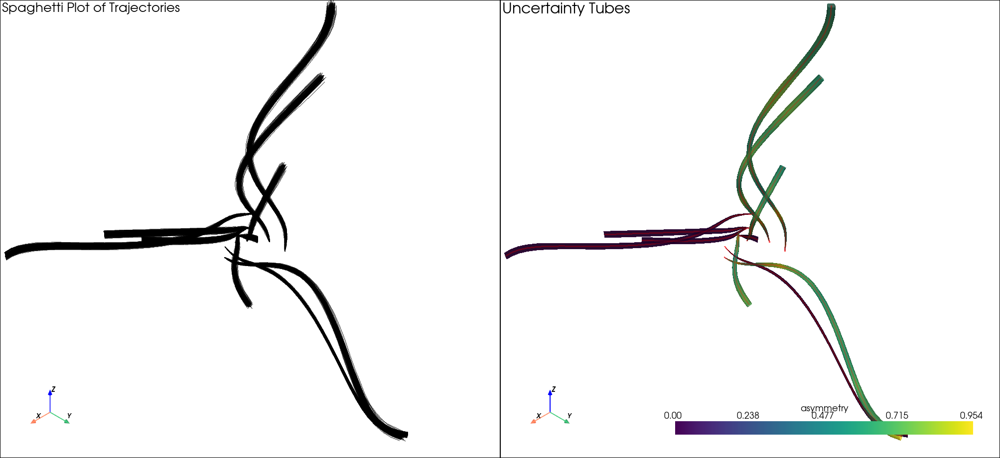

Examples
========

The examples below are runnable scripts from the repository. Their descriptions
and layout are maintained manually, while each commented source listing,
download, and result image is included directly from version-controlled files.
Sphinx does not import or execute these scripts during a documentation build.

Run an example from the repository root in the ``uvisbox`` Conda environment:

.. code-block:: console

   conda run -n uvisbox python examples/contour_boxplot_example.py

Contour boxplot
---------------

Summarize an ensemble of two-dimensional scalar fields with representative,
central, and outlying contours.

:download:`Download the contour boxplot example <../../examples/contour_boxplot_example.py>`

.. include:: ../../examples/contour_boxplot_example.py
   :start-after: """
   :end-before: """

Curve boxplot
-------------

Create a curve ensemble and visualize its central regions using curve band depth.

:download:`Download the curve boxplot example <../../examples/curve_boxplot_example.py>`

.. include:: ../../examples/curve_boxplot_example.py
   :start-after: """
   :end-before: """

Functional boxplot
------------------

Compare functional and modified functional band depth using the bundled sea
surface temperature data.

:download:`Download the functional boxplot example <../../examples/functional_boxplot_example.py>`

.. include:: ../../examples/functional_boxplot_example.py
   :start-after: """
   :end-before: """

Probabilistic marching cubes
----------------------------

Visualize isosurface-crossing probabilities for an ensemble on a regular
three-dimensional grid.

:download:`Download the marching cubes example <../../examples/probabilistic_marching_cubes_example.py>`

.. include:: ../../examples/probabilistic_marching_cubes_example.py
   :start-after: """
   :end-before: """

Probabilistic marching squares
------------------------------

Visualize isocontour-crossing probabilities on a regular two-dimensional grid.

:download:`Download the marching squares example <../../examples/probabilistic_marching_squares_example.py>`

.. include:: ../../examples/probabilistic_marching_squares_example.py
   :start-after: """
   :end-before: """

Probabilistic marching tetrahedra
---------------------------------

Visualize isosurface-crossing probabilities on a tetrahedral mesh.

:download:`Download the marching tetrahedra example <../../examples/probabilistic_marching_tet_example.py>`

.. include:: ../../examples/probabilistic_marching_tet_example.py
   :start-after: """
   :end-before: """

Probabilistic marching triangles
--------------------------------

Visualize isocontour-crossing probabilities on a triangular mesh.

:download:`Download the marching triangles example <../../examples/probabilistic_marching_triangles_example.py>`

.. include:: ../../examples/probabilistic_marching_triangles_example.py
   :start-after: """
   :end-before: """

Two-dimensional squid glyphs
----------------------------

Represent directional and magnitude uncertainty in an ensemble of planar vector
fields.

:download:`Download the 2D squid glyph example <../../examples/squid_glyphs_2D_example.py>`

.. include:: ../../examples/squid_glyphs_2D_example.py
   :start-after: """
   :end-before: """

Three-dimensional squid glyphs
------------------------------

Represent uncertainty in an ensemble of three-dimensional vectors with PyVista.

:download:`Download the 3D squid glyph example <../../examples/squid_glyphs_3D_example.py>`

.. include:: ../../examples/squid_glyphs_3D_example.py
   :start-after: """
   :end-before: """

Uncertainty lobes
-----------------

Visualize directional uncertainty in a two-dimensional vector field.

:download:`Download the uncertainty lobes example <../../examples/uncertainty_lobes_2D_example.py>`

.. include:: ../../examples/uncertainty_lobes_2D_example.py
   :start-after: """
   :end-before: """

Uncertainty tube
----------------

Construct a three-dimensional tube around an ensemble of trajectories.

:download:`Download the uncertainty tube example <../../examples/uncertainty_tube_example.py>`

.. include:: ../../examples/uncertainty_tube_example.py
   :start-after: """
   :end-before: """

Value-suppressing uncertainty palette
-------------------------------------

Compare discrete and continuous modes of the :class:`uvisbox.Core.Colors.ColorTree`
value-suppressing uncertainty palette.

:download:`Download the VSUP example <../../examples/vsup_example.py>`

.. include:: ../../examples/vsup_example.py
   :start-after: """
   :end-before: """
